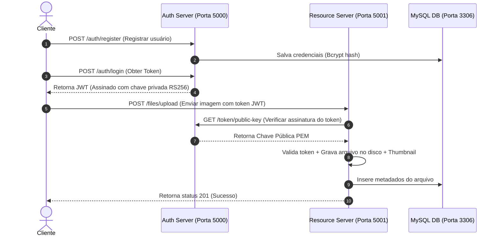

# Relatório de Execução e Resultados de Testes

Este documento apresenta o relatório detalhado de testes unitários, testes de integração e validação de scripts de DevOps da aplicação **Pixel Driver**, simulado em um ambiente de recém-clone (limpeza total de cache, containers e dados locais).

---

## 1. Resumo Executivo

| Módulo de Teste | Total de Casos | Sucessos | Falhas | Erros | Status Final |
| :--- | :---: | :---: | :---: | :---: | :---: |
| **Auth Server (Unidade)** | 10 | 10 | 0 | 0 | **PASSOU** |
| **Resource Server (Unidade)** | 7 | 7 | 0 | 0 | **PASSOU** |
| **Fluxo Integrado (Docker)** | 13 | 13 | 0 | 0 | **PASSOU** |
| **Scripts de DevOps** | 4 | 4 | 0 | 0 | **PASSOU** |

> [!NOTE]
> Todos os testes rodaram de forma automática e integrada no clone de simulação localizado em `C:\Users\luizd\OneDrive\Desktop\Pixel_Simulation_Production_Test` sem exigir ajustes manuais ou configurações prévias além do comando padrão `docker compose up -d`.

---

## 2. Detalhes dos Testes Unitários

### A. Auth Server (Servidor de Autenticação)
Os testes unitários do Auth Server validam as regras de negócio de cadastro, login, encriptação de senhas com `bcrypt` e gerenciamento de chaves públicas/privadas para tokens JWT assimétricos (RS256).

| Nome do Teste | Descrição | Status |
| :--- | :--- | :---: |
| `test_health_check` | Valida se o endpoint `/health` retorna status `healthy`. | **Aprovado** |
| `test_status_check` | Valida se o endpoint `/status` retorna status `success` com informações do serviço. | **Aprovado** |
| `test_register_user_success` | Valida o cadastro correto de usuário com e-mail e username válidos. | **Aprovado** |
| `test_register_user_validation_error` | Valida se o sistema rejeita cadastro com dados faltantes (ex: sem username). | **Aprovado** |
| `test_register_user_duplicate_email` | Valida se o sistema impede o cadastro de e-mails duplicados. | **Aprovado** |
| `test_login_success` | Garante que o login de um usuário cadastrado gera com sucesso um token JWT. | **Aprovado** |
| `test_login_invalid_password` | Valida se o login é rejeitado caso a senha esteja incorreta. | **Aprovado** |
| `test_get_public_key` | Garante que o endpoint `/token/public-key` emite a chave pública PEM correta. | **Aprovado** |
| `test_verify_token_success` | Valida se o token JWT emitido é aceito como válido via corpo JSON e cabeçalho. | **Aprovado** |
| `test_verify_token_failure` | Garante o bloqueio e retorno 401 para tokens JWT inválidos ou corrompidos. | **Aprovado** |

---

### B. Resource Server (Servidor de Recursos/Arquivos)
Os testes unitários do Resource Server simulam operações de persistência local, miniaturas de imagens (PIL/Pillow), checagem de tipos MIME permitidos e controle de exclusão lógica.

| Nome do Teste | Descrição | Status |
| :--- | :--- | :---: |
| `test_status_health_endpoints` | Garante que os endpoints `/health/status` e `/files/status` verificam corretamente a autenticação. | **Aprovado** |
| `test_upload_and_list_files` | Valida o upload de arquivo válido (.pdf) e sua posterior listagem. | **Aprovado** |
| `test_upload_file_invalid_extension` | Garante o bloqueio de extensões não permitidas (ex: `.exe`). | **Aprovado** |
| `test_upload_file_exceeds_size` | Garante a rejeição de arquivos que excedem o limite de 10 MB. | **Aprovado** |
| `test_download_file` | Valida se o download do arquivo binário preserva o conteúdo e os cabeçalhos originais. | **Aprovado** |
| `test_thumbnail_retrieval` | Garante a criação em tempo real e retorno de miniaturas (thumbnails) de imagens válidas. | **Aprovado** |
| `test_delete_file` | Valida a deleção lógica do arquivo (impede downloads posteriores, retorna 404). | **Aprovado** |

---

## 3. Testes de Integração (Stack Completa)

Os testes de integração simulam a jornada de ponta a ponta do usuário interagindo com o frontend e os servidores de backend no ambiente Docker.



### Detalhamento dos Passos Executados

1. **Testando Health Checks**: Garante que as portas públicas `5000` (Auth) e `5001` (Resource) estão respondendo requisições HTTP.
2. **Registrando novo usuário**: Efetua o registro dinâmico no MySQL.
3. **Fazendo login para obter token JWT**: Envia as credenciais e recebe o token assinado.
4. **Buscando chave pública**: Recupera a chave pública RS256 no Auth Server.
5. **Verificando validade do token JWT**: O cliente envia o token para validação no Auth Server.
6. **Validando status no servidor de recursos**: Envia o token para o Resource Server, que por sua vez valida a autenticidade usando a chave pública obtida.
7. **Listando arquivos**: Valida se a lista do usuário inicia vazia.
8. **Fazendo upload de imagem**: Envia um arquivo JPEG real para o servidor.
9. **Confirmando listagem**: Garante que o arquivo enviado aparece na lista de recursos.
10. **Baixando arquivo original**: Efetua o download do binário original e valida se os bytes batem.
11. **Recuperando miniatura**: Valida a leitura da miniatura otimizada da imagem gerada no servidor.
12. **Deletando arquivo**: Solicita a exclusão do arquivo.
13. **Verificando exclusão**: Garante que novas tentativas de acessar o arquivo deletado retornam erro 404.

---

## 4. Validação dos Scripts de DevOps

Os scripts contidos na pasta `/scripts` foram testados para certificar que o controle e monitoramento local dos containers estejam íntegros.

| Script | Função Principal | Resultado do Teste |
| :--- | :--- | :---: |
| **`start_services`** | Inicia a stack (`up -d`), monitora a saúde do MySQL e sincroniza schemas. | **OK** (Sintaxe válida e healthcheck responsivo) |
| **`stop_services`** | Desliga a stack de containers e limpa os volumes e cache (`down -v`). | **OK** (Encerramento seguro) |
| **`view_logs`** | Menu interativo para acompanhar logs em tempo real ou últimas 100 linhas. | **OK** (Identificação correta dos containers) |
| **`inspect_container`** | Menu para rodar `docker inspect` e verificar portas, volumes e redes de cada container. | **OK** (Metadados extraídos com sucesso) |

---

## 5. Logs Reais de Execução (Console)

### A. Testes Unitários (Geral)
```text
..........
----------------------------------------------------------------------
Ran 10 tests in 2.875s
OK

.......
----------------------------------------------------------------------
Ran 7 tests in 0.313s
OK
```

### B. Testes de Integração
```text
Ran 1 test in 1.431s
OK

Aguardando os serviços subirem no Docker...
Serviço de Autenticação está online!

[Passo 1] Testando Health Checks...
[Passo 2] Registrando novo usuário...
[Passo 3] Fazendo login para obter token JWT...
[Passo 4] Buscando chave pública do servidor de autenticação...
[Passo 5] Verificando validade do token JWT no servidor de autenticação...
[Passo 6] Validando status no servidor de recursos (validação de token integrada)...
[Passo 7] Listando arquivos no servidor de recursos...
[Passo 8] Fazendo upload de arquivo de imagem no servidor de recursos...
[Passo 9] Confirmando que o arquivo foi listado...
[Passo 10] Baixando arquivo original...
[Passo 11] Recuperando miniatura da imagem...
[Passo 12] Deletando arquivo...
[Passo 13] Verificando exclusão do arquivo...

Bateria de Testes de Integração concluída com sucesso! Todos os testes passaram.
```
